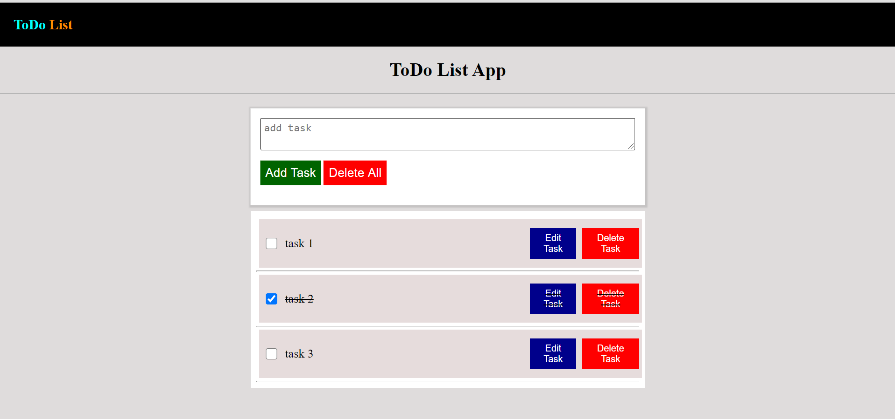

# ToDo List Application using vanilla Js and localStorage

## To run the app locally:
<pre>
    1. Clone the project.
    2. Open the index.html file in browser.
</pre>

* Functionality
    * Add Task
    * Delete Task
    * Edit Task
    * Delete All

* Functions (in code)
    * createTask
    * addTask
    * showContent
    * editTask
    * deleteBtn

[Click Here To Check Live Demo](https://ayushkumar731.github.io/todo-list-app/)

